# Star Schema Inicial

Este e o desenho inicial do modelo dimensional. Ele deve evoluir conforme os campos reais da Camara e do Senado forem integrados.

```mermaid
erDiagram
    DIM_POLITICO ||--o{ FATO_GASTO : realiza
    DIM_POLITICO ||--o{ FATO_REMUNERACAO : recebe
    DIM_POLITICO ||--o{ FATO_VOTO : vota
    DIM_POLITICO ||--o{ FATO_PRESENCA : registra
    DIM_POLITICO ||--o{ FATO_RESULTADO_ELEITORAL : disputa

    DIM_CALENDARIO ||--o{ FATO_GASTO : referencia
    DIM_CALENDARIO ||--o{ FATO_REMUNERACAO : referencia
    DIM_CALENDARIO ||--o{ FATO_VOTO : referencia
    DIM_CALENDARIO ||--o{ FATO_PRESENCA : referencia
    DIM_CALENDARIO ||--o{ FATO_RESULTADO_ELEITORAL : referencia

    DIM_PROPOSICAO ||--o{ FATO_VOTO : votada
    DIM_ORGAO ||--o{ FATO_PRESENCA : ocorre_em
    DIM_ORGAO ||--o{ FATO_VOTO : deliberada_em
    DIM_FORNECEDOR ||--o{ FATO_GASTO : recebe
    DIM_TIPO_DESPESA ||--o{ FATO_GASTO : classifica
    DIM_FONTE_DOCUMENTAL ||--o{ FATO_PRESENCA : evidencia
    DIM_FONTE_DOCUMENTAL ||--o{ FATO_VOTO : evidencia

    DIM_POLITICO {
        int sk_politico PK
        int id_parlamentar_camara
        int id_parlamentar_senado
        int id_parlamentar_alerj
        int sq_candidato_tse
        string nome_civil
        string nome_parlamentar
        string sigla_partido
        string sigla_uf
        string casa_legislativa
        string cargo
        string situacao_mandato
        date data_inicio_mandato
        date data_fim_mandato
    }

    DIM_CALENDARIO {
        int sk_data PK
        date data
        int ano
        int mes
        int dia
        int trimestre
        string nome_mes
        bool eh_fim_de_semana
    }

    DIM_PROPOSICAO {
        int sk_proposicao PK
        int id_proposicao
        string sigla_tipo
        int numero
        int ano
        string ementa
        string tema
        string status_atual
    }

    DIM_ORGAO {
        int sk_orgao PK
        int id_orgao
        string nome_orgao
        string sigla_orgao
        string tipo_orgao
        string casa_legislativa
    }

    DIM_FORNECEDOR {
        int sk_fornecedor PK
        string cpf_cnpj
        string nome_fornecedor
        string tipo_fornecedor
    }

    DIM_TIPO_DESPESA {
        int sk_tipo_despesa PK
        string tipo_despesa
        string categoria_despesa
    }

    DIM_FONTE_DOCUMENTAL {
        int sk_fonte_documental PK
        string casa_legislativa
        string tipo_fonte
        string titulo
        string url
        string formato
        string status_extracao
    }

    FATO_GASTO {
        int sk_gasto PK
        int sk_politico FK
        int sk_data FK
        int sk_fornecedor FK
        int sk_tipo_despesa FK
        string numero_documento
        string url_documento
        decimal valor_documento
        decimal valor_glosa
        decimal valor_liquido
        int ano_competencia
        int mes_competencia
    }

    FATO_INDICADOR_PARLAMENTAR {
        int sk_indicador PK
        int sk_politico FK
        int sk_data FK
        decimal gasto_ytd_ano_atual
        decimal gasto_ytd_ano_anterior
        decimal diferenca_yoy
        decimal variacao_yoy_pct
        decimal pct_presenca_eventos
        decimal dif_gasto_media_partido
        decimal dif_presenca_media_partido
        decimal dif_gasto_media_uf
        decimal dif_presenca_media_uf
    }

    FATO_VOTO {
        int sk_voto PK
        int sk_politico FK
        int sk_data FK
        int sk_proposicao FK
        int sk_orgao FK
        string voto
        string orientacao_partido
        bool voto_alinhado_partido
        string resultado_votacao
    }

    FATO_REMUNERACAO {
        int sk_remuneracao PK
        int sk_politico FK
        int sk_data FK
        string cargo
        string tipo_remuneracao
        decimal valor_subsidio_bruto
        decimal valor_auxilio_moradia
        decimal valor_liquido
        string fonte_url
    }

    FATO_PRESENCA {
        int sk_presenca PK
        int sk_politico FK
        int sk_data FK
        int sk_orgao FK
        string tipo_evento
        string status_presenca
        bool presente
        bool ausencia_justificada
    }

    FATO_PRESENCA_PLENARIO {
        int sk_presenca_plenario PK
        int sk_politico FK
        int sk_data FK
        string descricao_sessao
        string frequencia_sessao
        bool presente_plenario
        bool ausencia_justificada
        bool ausencia_nao_justificada
    }

    FATO_RESULTADO_ELEITORAL {
        int sk_resultado_eleitoral PK
        int sk_politico FK
        int sk_data FK
        int ano_eleicao
        string turno
        string cargo
        string abrangencia
        int numero_candidato
        int votos_nominais
        int municipios_com_voto
        string situacao_total_turno
        bool eleito
    }
```

## Observacoes

- `DIM_POLITICO` deve aceitar identificadores da Camara, Senado, ALERJ e TSE para permitir analises unificadas entre casa legislativa e eleicao.
- `DIM_CALENDARIO` deve ser compartilhada por todos os fatos.
- `FATO_GASTO` representa granularidade de lancamento de despesa.
- `FATO_REMUNERACAO` representa granularidade mensal de remuneracao por parlamentar.
- `FATO_VOTO` representa granularidade de voto individual por parlamentar e proposicao.
- `FATO_PRESENCA` representa granularidade de registro individual de presenca por parlamentar, data e orgao. A primeira versao usa presencas em eventos da Camara; sessoes de plenario podem entrar como fonte complementar.
- `FATO_PRESENCA_PLENARIO` representa a presenca formal em sessoes de plenario, incluindo ausencias justificadas e nao justificadas.
- `FATO_INDICADOR_PARLAMENTAR` representa indicadores derivados para leitura executiva no BI, como YoY e diferencas contra medias de partido e UF.
- `FATO_RESULTADO_ELEITORAL` representa a votacao eleitoral por candidato/cargo, inicialmente usada para deputados estaduais do RJ em 2022.
- `DIM_FONTE_DOCUMENTAL` registra fontes semiestruturadas, como paginas e PDFs da ALERJ, para manter rastreabilidade ate que sejam convertidas em fatos estruturados.
